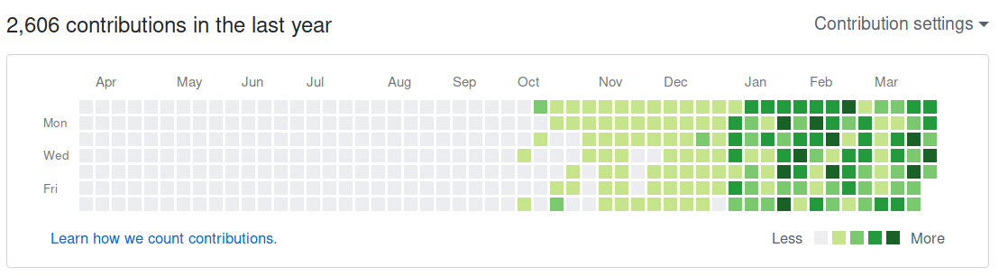

# GitHubで小説を毎月10万字書いた

はじめに言っておくが，以下のポエムは全てフィクションだと思っていただきたい。  

今年の元日から書きつづけてきた小説「[オブリビオン・リポート](https://jamcha-aa.gitbooks.io/oblivionreports/content/)」が完結した。なんとなく3月くらいまでに終わるだろうな，とは思っていたが，それまで生きていられるとは全く思っていなかったので，不思議な気分である。私は何か作品を書き終えるごとにツイートするという癖があるのだが，この作品に関してはブログの作品リストにひっそり掲載しているほかは一切のアピールをしていなかったのも，私が死ぬか飽きるかして未完のまま終わるだろうなと思っていたためだ。  

オブリビオン・リポートを書きはじめてから完結するまでのカレンダーは下のようになる。  

  

Jan の1マス左からが2018年なのだが，明白にコミット数が増え，それがほぼ継続しているのがわかるだろう。私はこの間，ポリポリ菓子を食べるように気楽に書いていると，GitHubの芝がどんどん濃くなっていって，それを「すごいなー」と他人事のように感じていた。  

オブリビオン・リポートは本文が大体30万字強，原稿用紙に換算して1000枚程度である。これ以外にもいくつかの作品を書いたので，実際にはGitHubで毎月11〜12万字くらい書いていたことになる。もともと私は文章を書くのが本当に苦手で，今まで"[How to Write a Lot](http://www.apa.org/pubs/books/4441010.aspx)" や "[毎日文章を書くことのススメ](https://postd.cc/write-everyday/)" を真似しても，いざ画面に向かうと固まってしまい，いっこうに手が動かなかったのだが，それが内容はともかく，人が変わったように書けるようになったのは奇妙なことだった。  

主に使用していたのは，その昔ネットブックと呼ばれていたEeePCというノートPCである。10年前の骨董品だ。だがゴミではない。というより，もともと壊れてもいない古いPCをスペックが低いからという理由でゴミ扱いすることへの不満が先にあった。ただそれを払拭するにはEeePCが今でも十分に使えるものであることを示すしかないので，性能の低いEeePCでも実力を発揮できる書き物をしよう，ということで長めの小説を書き始めたのだった (その決意の顛末は小説「[EeePCとEmacsと○○と](https://jamcha-aa.gitbooks.io/eeepc/content/)」に書いた)。  

すると，ただの執念で使いはじめたEeePCに，書くことを促すための要素がいくつか備わっていたようで，私にタイトルのような結果をもたらした。その要素は書ける人からすれば当たり前だろうし，特に真新しいものではないけれど，ここではEeePCが持っていた2つの特徴を紹介したいと思う。  

## 断つ

SF作家のNeal Stephensonは，パソコンで仕事ができない理由について[インターネットの誘惑](https://www.reddit.com/r/Fantasy/comments/vdt11/i_am_neal_stephenson_author_geek_and_now_sword/c53nsh5/)をあげている。それに，メールやSNSの通知がいかに気を紛らわせるかは[Uri Bramのコラム](https://postd.cc/do-not-disturb/)で詳しく述べられている。ネットは書くことの敵だ。  

ネットを断つには2つのアプローチがある。ひとつはポメラなどのようにネット自体を廃すること，もう一つはネットが使えないほど低性能の機械を使うことである。文章を書くというのはさほどスペックを必要としないので，工夫次第で骨董品レベルのコンピュータでも実用に足るものになる。それを示すものとして，たとえば「ゲーム・オブ・スローンズ」の作者George R. R. Martinは，[MS-DOSでWordstarを使って作品を書いている](https://www.youtube.com/watch?v%3DX5REM-3nWHg)。  

ではEeePCの場合はどうか。EeePCはネットが使える。ただそれは，東京からロサンゼルスまでは泳いでいける，というのと同じような意味で，現実的ではない。阿部寛のホームページは見れるが，そこに至るまでのGoogle検索に1分くらいかかる。苦痛である。すると何が起きたか。アルコール依存を断つためにシアナマイドを服用するように，ネットを使うたびにイライラするので，やがて嫌悪条件づけのメカニズムによってネットの誘惑が弱まっていった。かといって完全に断たれたわけではなく，テキストブラウザを使って単語検索や類語検索などの最低限の利用が許されている。ネットを断つために一時的にプロバイダを解約するなどの強硬手段をとる作家もいるけれど，私の場合は，EeePCの性能があまりに低いことが幸いし，不要なネット利用を無理なく制限することができたのだ。  

## コミット駆動型執筆 (commit-driven writing)

大それた見出しがついているが，行数でなくコミット数を執筆の目安にしてみよう，というものである。私は条件をつけたほうが面白いからという理由で，GitHubの芝の色を毎日真ん中の緑にしよう，と考えた。すると，話が行き詰まっているときでもコミットしなければならないので，あの手この手でコミット数を稼ごうとする。  

たとえば，オブリビオン・リポートで各章の冒頭一文だけ書いてコミットしているものが結構ある。そういうときは行き詰まっているときで，往々にして続きを書かずに校正ばかりしている。表現が気にいらないので，同じ文を何回も直す。明治時代のドラマなどで作家が原稿用紙を丸めて捨てるような場面があるが，それに似た雰囲気かもしれない。私の文章はへなちょこなので，直しても表現が良くなるわけではないのだが，重要なのは丸めた原稿用紙の視覚化である。  

コンピュータで文章を書くとき，校正は作業量として実感できない。痕跡が消えるからだ。かたやGitは校正作業もコミットとしてカウントしてくれるので，文章が進まなくても苦闘の記録が残る。達成感が得られる。精神科医のHeinz Kohutは，課題を克服する際には自己肯定感を保つことが肝要であることを述べている。今日は書けなかった，という後ろめたさがあると，明日頑張ろう，と無理に考え泥沼にはまってしまいがちになるが，今日はGitHubの芝が真ん中の緑になったからいいや，と考えると，何の気負いもせず翌日も画面に向かうことができる。EeePCでGitが使えるというのはポメラにはない強みだった。  

## その他: 健康

EeePCとは関係ないが，体調の程度でこうもペースが変わるのかと思ったので書いておきたい。先のカレンダーで2月末あたりから3月初旬にかけてコミット数が極端に減っているのだが，これは身体の不調のためである。このまま完結しない作品のひとつとしてネットの海を漂うのかと危惧したが，立て直すことができたのは運が良かった。プログラミングや解析であれば，開発ツールが優秀なおかげで身体が不調でもなんとかなることが多いのだが，創作に関しては綺麗に頭真っ白になってしまうので，健康の重要さを再認識した。  

## 継続して書きつづけること

タイトルでは自己顕示欲がぬぐいきれず，つい挑発的に毎月10万字と書いてしまったが，一日に直せばわずか3000字程度でしかない。そんな気負ったつもりもなく，毎日気軽に続けるだけでも結構な量になって，継続が生み出す掛け算の力は偉大だなあ，と感嘆した次第である。たくさん書く，というと，誰それが毎時何千字といった話題を良く見るし，情熱と体力がありあまるような人はどこまでも速度の高みを目指すべきだろう。ただ，村上春樹のように毎日4000字，というアプローチでも，継続しつづけることで，wikipediaの作品リストをスクロールしつづけてもなかなか終わらないほどの膨大な量を生み出すことができる。  

今後もGitHubで毎月10万字書きつづけられるかはわからない。一日の文章生産量は決まっているので，他で書かなければならない量が増えれば，それに応じてGitHubに書く量は減る。いつまで生きていられるのかもわからないが，休止しているものや，頭の中で日々生み出されているものもあるので，表現せずにはいられないものがあればまた書くのではないかと思う。  

   
   
(c) 2018 jamcha (jamcha.aa@gmail.com).  

