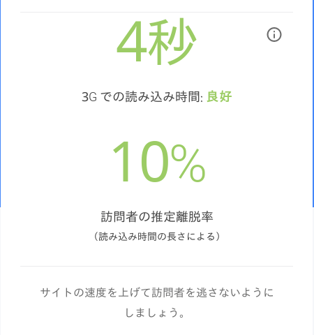
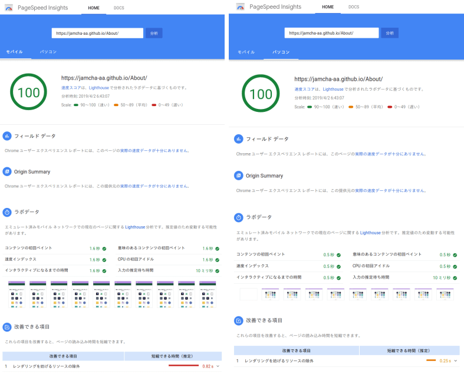
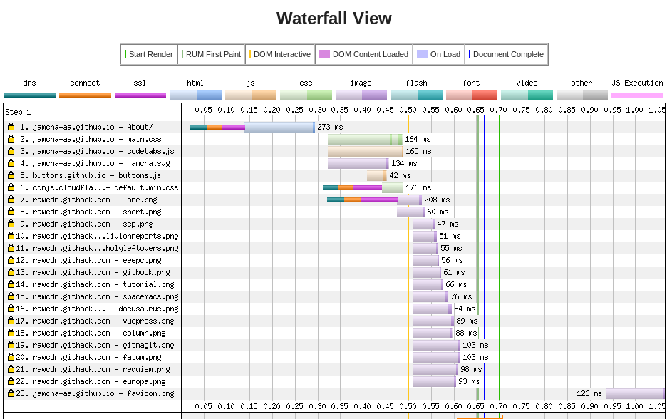

# [私のホームページ](https://jamcha-aa.github.io/About/)が阿部寛のホームページに 0.015 秒差まで迫った

    

## 訪問者の推定離脱率 10%

これまでずっと [阿部寛のホームページ](http://abehiroshi.la.coocan.jp/) の美しさと速さに憧れ， [私のホームページ](https://jamcha-aa.github.io/About/) でもシンプルさを心がけてきた。 [PageSpeed Insights](https://developers.google.com/speed/pagespeed/insights/?hl=ja) でもモバイル版で 99/100，パソコン版で 100/100 を獲得し，私は満足していた (なお阿部寛のホームページは速すぎるのか PageSpeed Insights だとエラーが出る)。  

しかしツメが甘かった。もしくは気にしないようにしていた。なぜモバイル版が満点じゃなかったのか。それが生み出した多くの損失に気づいたのは，今年のエイプリルフールに入ってからだった。Debian GNU/Linux から派生した [Devuan](https://devuan.org/) のサイトで [まんまと騙された](https://web.archive.org/web/20190401025707/http://www.devuan.org/pwned.html) 私は，システムをウイルススキャンしている間にひとつの Web サービスを知った。  

[モバイルサイトの読み込み速度とパフォーマンスをテストする - Google](https://testmysite.withgoogle.com/intl/ja-jp)  

これをテストしたところ， [私のホームページ](https://jamcha-aa.github.io/About/) の結果は **訪問者の推定離脱率 10%** だった。  

  

おかしい。PageSpeed Insights では 2 秒を切るくらいだったはずなのだが。この違いが生じた原因について，Google はテスト中に次のように示している。  

> [世界のモバイル回線接続のうち 70%が，2020 年まで 3G 以下の速度にとどまると予想されています。](https://www.thinkwithgoogle.com/data-gallery/detail/cellular-network-connections-slow-speeds/)  

つまり [私のホームページ](https://jamcha-aa.github.io/About/) は高速回線でなければ遅いということだ。あたりまえのような話だが阿部寛のホームページは違う。速度制限にひっかかっていても素早く読者に情報を届けてくれる。 [私のホームページ](https://jamcha-aa.github.io/About/) はそのレベルに達していない。モバイル版に足りない 1 点を埋める努力しないかぎり，本来読者になる人を失礼にも追い返すことになってしまう。恐ろしいことだ。今後クラウドゲーミングなどの影響で回線はさらに混雑し，状況はどんどん悪化していくだろう。  

どれほど魅力的なコンテンツがあっても，利用者の端末で見られなければ意味がない。回線が遅くても快適な Web サイトが求められている。 **Google は『阿部寛のホームページを目指せ』と言っている。** そう私は解釈し，私にできる範囲内で高速化を目指すことにした。  

## 画像容量の縮小

[私のホームページ](https://jamcha-aa.github.io/About/) の基盤になっている [Docusaurus](https://docusaurus.io) は，[昨年 8700 億円近くを『研究開発費』に投じた](https://www.recode.net/2018/4/9/17204004/amazon-research-development-rd) Facebook が開発しているだけあって速い。つまり遅くしているのは私だ。  

何が私のホームページを遅くしているのか。PageSpeed Insights は以前から， [私のホームページ](https://jamcha-aa.github.io/About/) の画像が重いこと，具体的には [『 EeePC と Emacs と○○と』](https://jamcha-aa.github.io/EeePC/) のアイコンが『阿部寛のホームページ』の写真くらい重いことを指摘していた。だが私は [このアイコン](https://raw.githubusercontent.com/jamcha-aa/About/d769f1631ccc0afee272fec8f026124490b9cab4/website/static/img/users/eeepc.png) が気に入っていて，しかも縮小するとぐちゃぐちゃになるので，そのアドバイスを無視しつづけてきた。とはいえこのことが原因で遅くなるのは嫌だ。仕方なく，私はアイコンをより軽いものへ変更した。  

さらに，これまで 800 x 800 くらいのサイズのアイコン画像であっても「縮小表示されるからいいや」と平気で置いていたのだが，葬られた EeePC のアイコンが私に手抜きを許さないよう怨念を放っているように感じられたので，表示されるサイズに合わせて他のアイコンも小さくした。  

## CDN の活用

GitHub にアップロードした画像は raw.githubusercontent.com から読み込まれる。この読み込みを速くするため [githack](https://raw.githack.com) を利用し，そこで作られたリンクを Web サイトに張るようにした。  

## 評価結果

### モバイルサイトの速度をテストしましょう

画像をちょこっといじっただけだが，無事『訪問者の推定離脱率: 低』を達成した。  

  

### PageSpeed Insights

従来のパソコン版に加え，モバイル版も 100 点満点になった。  

  

### WebPageTest

[私のホームページ](https://jamcha-aa.github.io/About/) がどれくらい速くなったのか，Web 界のベンチマークである阿部寛のホームページと [WebPageTest](https://webpagetest.org) で比較することにした。また私のホームページは小説サイトなので，世の中の小説サイトがどれくらい速いのか [『カクヨム』](https://kakuyomu.jp) と [『セルバンテス』](https://cervan.jp/%0A%0A) の表示速度も調べた。なお小説サイトを牽引している [『小説家になろう』](https://syosetu.com) は WebPageTest を弾くので除外した。  

-   [私のホームページ](https://webpagetest.org/result/190401_BZ_94a6b9302ce934402d63d80941eb54a5/)  
    
      
    
    以前は AAAFF みたいなパワプロの張本勲っぽい成績だったような気がする。今回大幅に改善した。

-   [阿部寛のホームページ](https://webpagetest.org/result/190401_T5_c88fdb8b5000f16229c45b501f0e5c67/)  
    
      
    
    3 月に阿部寛の画像が圧縮されたものに変わったので，画像圧縮の評価が B にパワーアップした。

-   [カクヨム](https://webpagetest.org/result/190401_C8_dd3c4744687513c564959cad4418a3cc/)

-   [セルバンテス](https://webpagetest.org/result/190401_FJ_063694252e5f7ecfddc55f03e0c6cb8f)

### 速度指標比較 ( [dev.to と阿部寛のホームページについてちゃんと計測させてくれ](https://qiita.com/naru0504/items/7d652681d698f6d88c4f) を参考に作成)

| 指標                 | 私のホームページ | 阿部寛のホームページ | カクヨム  | セルバンテス |
|---------------------|-----------------:|---------------------:|----------:|------------:|
| 読み込み速度         | **0.666 秒**       | **0.651 秒**           | 11.928 秒 | 2.219 秒     |
| ファーストバイト     | 0.289 秒         | 0.143 秒             | 0.517 秒  | 0.302 秒     |
| レンダー開始         | 0.700 秒         | 0.200 秒             | 4.500 秒  | 1.200 秒     |
| スピードインデックス | 0.764 秒            | 0.617 秒                | 4.835 秒     | 1.200 秒        |
| 通信量               | 53KB             | 39KB                 | 6,648KB   | 298KB        |

[私のホームページ](https://jamcha-aa.github.io/About/) が速くなって一番驚いたのは私だ。以前は読み込み速度が 1.8 秒くらいかかっていた記憶があるのだが，今はコンスタントに 0.7 秒を切り，約 1 秒で全て表示される。ただ，何十回も走らせているわけではないので，表の数値がベストの値でも信頼できる値でもないことについてはご注意いただきたい。  

パフォーマンスの向上に最も貢献したのはおそらく [githack](https://raw.githack.com) だろう。0.5 秒を境に一斉に画像がダウンロードされ，大幅な時間短縮につながっている。  

  

## 100m を 5 秒で走っていたランナーが 9 秒台まで落ちてきた

[私のホームページ](https://jamcha-aa.github.io/About/) は確かに速くなった。改善の結果，憧れていた阿部寛のホームページに匹敵する読み込み速度になった。この事実に初めは喜んだが，その後私はある異変に気づいた。  

阿部寛のホームページが遅くなっているのだ。阿部寛のホームページを愛する人なら，食い気味に表示される阿部寛の顔に安らぎをおぼえたと思う。しかし現在は 0.4 〜 0.7 秒あたりでうろうろして，以前のような速度で表示されるのは何回かに 1 回くらい。つまり今回のテスト結果は，私のホームページが速くなったというよりも，100m を 5 秒で走っていた人外のランナーが 9 秒台の人類レベルまで落ちてきたことによるものだといえる。  

[WebPageTest の結果](https://webpagetest.org/result/190401_T5_c88fdb8b5000f16229c45b501f0e5c67/) によると，現在，阿部寛のホームページは htm ファイルのダウンロード速度が安定しないようだ。最近になってトップページの写真が変わったので，私を含め多くの人が昼夜を問わずアクセスし，それで遅くなっているのかもしれない。もしそうなら素晴らしい。サーバー側の問題であれば解決されることを祈る。そしてこれらのハンデをものともせず，阿部寛のホームページは 1 秒未満で，ダイヤルアップ接続であってもわずか 7 秒で，今日も私たちに最新情報を届けている。  

   
   
(c) 2019 jamcha (jamcha.aa@gmail.com).  

  

